# 🎓 Student Course Enrollment System

<div align="center">


<br/>

**A production-ready, full-stack enterprise web application for managing academic courses, student enrollments, fee payments, and administrative workflows.**

<br/>

[🚀 **Live Demo on Render**](https://student-course-enrollment.onrender.com) &nbsp;•&nbsp;
[💻 **GitHub Repository**](https://github.com/rahulsinghkushwaha232/Student-Course-Enrollment-System) &nbsp;•&nbsp;
[📖 **Swagger API Docs**](https://student-course-enrollment.onrender.com/swagger-ui/index.html) &nbsp;•&nbsp;
[🐞 **Report Bug**](https://github.com/rahulsinghkushwaha232/Student-Course-Enrollment-System/issues)

</div>

---

## 📌 Quick Access & Links

| Resource | Link | Description |
| :--- | :--- | :--- |
| 🌐 **Live Website (Render)** | [student-course-enrollment.onrender.com](https://student-course-enrollment.onrender.com) | Live deployed full-stack application |
| 🐙 **GitHub Repository** | [github.com/rahulsinghkushwaha232/Student-Course-Enrollment-System](https://github.com/rahulsinghkushwaha232/Student-Course-Enrollment-System) | Complete source code & documentation |
| 📑 **API Documentation** | [Swagger UI Live](https://student-course-enrollment.onrender.com/swagger-ui/index.html) | Interactive OpenAPI 3.0 testing console |
| 👤 **Lead Author** | [Rahul Singh Kushwaha](https://github.com/rahulsinghkushwaha232) | Project Creator & Full Stack Developer |

> ℹ️ **Note on Live Render URL:** If your Render service was assigned a custom subdomain (e.g. `student-course-enrollment-xxxx.onrender.com`), verify your exact URL in the [Render Dashboard](https://dashboard.render.com). Because Render free tier spins down inactive instances, please allow 30–50 seconds for the initial cold start.

---

## 🔑 Demo Login Credentials

You can test both **Admin** and **Student** experiences right away using the pre-configured credentials:

| Role | Email Address | Password | Access Level |
| :--- | :--- | :--- | :--- |
| 🛡️ **Administrator** | `admin@system.com` | `Admin@123` | Full CRUD, Admin Panel, Student & Course Management, Analytics |
| 🎓 **Student** | `student@system.com` | `Student@123` | Browse Courses, Enroll in Courses, Payment Flow, View Profile |

---

## ✨ Key Features

### 🔐 Authentication & Security
- **JWT (JSON Web Tokens)** stateless session management.
- **Role-Based Access Control (RBAC)** separating `ROLE_ADMIN` and `ROLE_STUDENT`.
- Secure password hashing using **BCrypt**.
- Protected route guards on the React client and filter chains on Spring Security.

### 👨‍🎓 Student Management
- Complete CRUD operations (Add, View, Update, and Delete students).
- Real-time client & server-side form validations.
- Instant search, multi-column sorting, and responsive pagination.
- Student profile image upload and avatar management.

### 📚 Course Catalog
- Create and edit academic courses with code, title, description, credits, and tuition fee.
- Real-time seat capacity tracking and enrollment status.
- Course categorization and prerequisites.

### 💳 Enrollment & Simulated Payment Gateway
- Seamless course registration flow for students.
- **Simulated PhonePe Payment Gateway**: Experience realistic UPI / QR / Card payment flow with instant status transitions (`PENDING` ➔ `PAID`).
- Downloadable receipt preview and enrollment history.

### 📊 Interactive Analytics Dashboard
- Comprehensive metrics: Total Students, Active Courses, Total Enrollments, Revenue Collected.
- Visual charts powered by **Recharts** (Enrollment trends, Course popularity).
- Recent activity stream with live status indicators.

### 🎨 Modern UI / UX
- Clean, responsive glassmorphism UI built with **React 19** and modern CSS.
- **Light / Dark mode toggle** with persistent local storage theme memory.
- Mobile-responsive navigation and accessible components.

---

## 🏗️ System Architecture

```mermaid
flowchart LR
    subgraph Client["Frontend (React 19 + Vite)"]
        UI["User Interface / Tailwind & CSS"]
        Router["React Router DOM"]
        AxiosClient["Axios HTTP + JWT Interceptor"]
    end

    subgraph Server["Backend (Spring Boot 3 REST API)"]
        Filter["Spring Security JWT Filter"]
        Controllers["REST Controllers (/api)"]
        Services["Business Logic Layer"]
        Repositories["Spring Data JPA Repositories"]
    end

    subgraph Storage["Database Layer"]
        DB[(PostgreSQL / MySQL 8)]
    end

    UI --> Router --> AxiosClient
    AxiosClient -- "HTTPS / JSON + Bearer Token" --> Filter
    Filter --> Controllers --> Services --> Repositories
    Repositories -- "Hibernate / JDBC" --> DB
```



---

## 🛠️ Technology Stack

| Domain | Technology | Purpose |
| :--- | :--- | :--- |
| **Frontend UI** | React 19, Vite, Vanilla CSS | Fast, reactive SPA interface |
| **Routing & State** | React Router 6, Context API | Client-side routing & auth state |
| **Icons & Charts** | Lucide React, Recharts | Modern icons and interactive analytics |
| **HTTP Client** | Axios | REST communication with JWT interceptors |
| **Backend Framework**| Spring Boot 3.x (Java 17) | Enterprise REST API and business logic |
| **Security** | Spring Security 6, JJWT | JWT authentication and RBAC |
| **ORM / Data Access**| Spring Data JPA, Hibernate | Object-Relational Mapping and DB transactions |
| **Database** | MySQL 8 (Local) / PostgreSQL (Cloud) | Relational persistence |
| **API Docs** | Springdoc OpenAPI / Swagger UI | Interactive REST endpoint documentation |
| **Containerization** | Docker (Multi-stage build) | Production-ready packaging |
| **Deployment** | Render Cloud Platform | PaaS hosting with continuous deployment |

---

## 🚀 Local Development Setup

Follow these steps to run the application locally on your machine:

### 1️⃣ Prerequisites
Ensure you have the following installed:
- [Java Development Kit (JDK) 17+](https://adoptium.net/)
- [Node.js (v18 or higher)](https://nodejs.org/) & npm
- [MySQL 8.0+](https://dev.mysql.com/downloads/installer/)

---

### 2️⃣ Clone Repository
```bash
git clone https://github.com/rahulsinghkushwaha232/Student-Course-Enrollment-System.git
cd Student-Course-Enrollment-System
```

---

### 3️⃣ Configure Database
1. Open MySQL Workbench or your terminal and verify MySQL is running on port `3306`.
2. The application will automatically create `student_course_db`. If needed, manually create it:
   ```sql
   CREATE DATABASE student_course_db;
   ```
3. Set your local MySQL password via environment variable (or configure `application.properties`):
   ```powershell
   # In Windows PowerShell:
   $env:DB_PASSWORD = "your-mysql-password"
   ```

---

### 4️⃣ Run Backend (Spring Boot)
```powershell
cd StudentCourseEnrollmentSystem
.\mvnw.cmd clean spring-boot:run
```
> The backend will start on **`http://localhost:8080`**.
> Swagger documentation will be accessible at: `http://localhost:8080/swagger-ui/index.html`.

---

### 5️⃣ Run Frontend (React + Vite)
Open a new terminal window:
```powershell
cd frontend
npm install
npm run dev
```
> The frontend will start at **`http://localhost:5173`**.

---

## 📡 REST API Endpoints Overview

| Method | Endpoint | Description | Access Level |
| :--- | :--- | :--- | :--- |
| `POST` | `/api/auth/register` | Register new user account | Public |
| `POST` | `/api/auth/login` | Authenticate user & receive JWT | Public |
| `GET` | `/api/auth/me` | Fetch currently logged-in user profile | Authenticated |
| `GET` | `/students` | Get paginated list of students | Admin / Staff |
| `POST` | `/students` | Create a new student record | Admin |
| `PUT` | `/students/{id}` | Update student details | Admin |
| `DELETE`| `/students/{id}` | Delete student record | Admin |
| `GET` | `/courses` | Retrieve all active courses | Authenticated |
| `POST` | `/courses` | Add a new course | Admin |
| `POST` | `/enrollments` | Enroll student into a course | Student / Admin |
| `PATCH`| `/enrollments/{id}/payment` | Update simulated payment status | Authenticated |
| `GET` | `/dashboard/stats` | Retrieve aggregate metrics and charts | Admin |

---

## 🐳 Docker & Cloud Deployment (Render)

This repository includes a production-ready multi-stage **`Dockerfile`** that builds both the React frontend and Spring Boot backend into a single unified container service:

1. **Stage 1 (Node.js)**: Builds React assets (`npm run build`).
2. **Stage 2 (Maven + JDK 17)**: Embeds compiled static frontend files into Spring Boot's `/static` directory and packages the `.jar`.
3. **Stage 3 (JRE 17)**: Produces an ultra-lightweight, secure runtime container image.

### Deploying to Render:
1. Fork or push this repository to GitHub.
2. In Render, select **New +** ➔ **Blueprint** and link your repository (uses [`render.yaml`](./render.yaml)).
3. Render will provision:
   - A managed PostgreSQL database (`student-course-enrollment-db`).
   - A Docker web service running the unified application on port `8080`.

---

## 📂 Project Directory Structure

```text
Student-Course-Enrollment-System/
├── .github/                           # GitHub workflows and config
├── Dockerfile                         # Unified multi-stage container build
├── render.yaml                        # Render Blueprint infrastructure spec
├── README.md                          # Main project documentation
├── SUBMISSION_CHECKLIST.md            # Lab evaluation & viva checklist
│
├── frontend/                          # React + Vite Client
│   ├── public/                        # Static assets & icons
│   ├── src/
│   │   ├── api/                       # Axios service endpoints
│   │   ├── components/                # Reusable UI components
│   │   ├── context/                   # Auth & Theme context providers
│   │   ├── layouts/                   # Layout wrappers (DashboardLayout)
│   │   ├── pages/                     # Application views (Login, Dashboard, etc.)
│   │   └── services/                  # Business logic & token storage
│   ├── package.json                   # Frontend dependencies
│   └── vite.config.js                 # Vite build config
│
├── StudentCourseEnrollmentSystem/     # Spring Boot REST API
│   ├── src/
│   │   ├── main/
│   │   │   ├── java/.../
│   │   │   │   ├── config/            # Security & CORS configuration
│   │   │   │   ├── controller/        # REST API endpoints
│   │   │   │   ├── dto/               # Request & Response DTOs
│   │   │   │   ├── model/             # JPA entity definitions
│   │   │   │   ├── repository/        # Data access interfaces
│   │   │   │   └── service/           # Business logic & payment simulation
│   │   │   └── resources/
│   │   │       ├── application.properties
│   │   │       └── schema.sql         # Initial seed data
│   │   └── test/                      # Unit & integration tests
│   └── pom.xml                        # Maven dependencies & build plugins
│
└── scripts/
    └── start.sh                       # Production database URL converter & startup
```

---

## 👨‍💻 Project Contributor & Author

<div align="center">

### **Rahul Singh Kushwaha**
*Full Stack Java & React Developer*

[](https://github.com/rahulsinghkushwaha232)
[](https://github.com/rahulsinghkushwaha232/Student-Course-Enrollment-System)

**Role & Contributions:**
- 🏛️ Full architecture design (Spring Boot REST API + React SPA).
- 🔒 Secure authentication system with JWT and Role-Based Access Control.
- 🎨 Complete user interface design with responsive layouts and Dark/Light mode.
- 💳 Simulated PhonePe payment integration and enrollment state machine.
- 🐳 Containerization with Docker multi-stage builds and Render cloud deployment.

</div>

---

## 📄 License

This project is licensed under the **MIT License** — feel free to use it for educational and personal reference.

---

<div align="center">
  <sub>Built with ❤️ by <b>Rahul Singh Kushwaha</b>. If you find this project helpful, give it a ⭐️ on GitHub!</sub>
</div>
